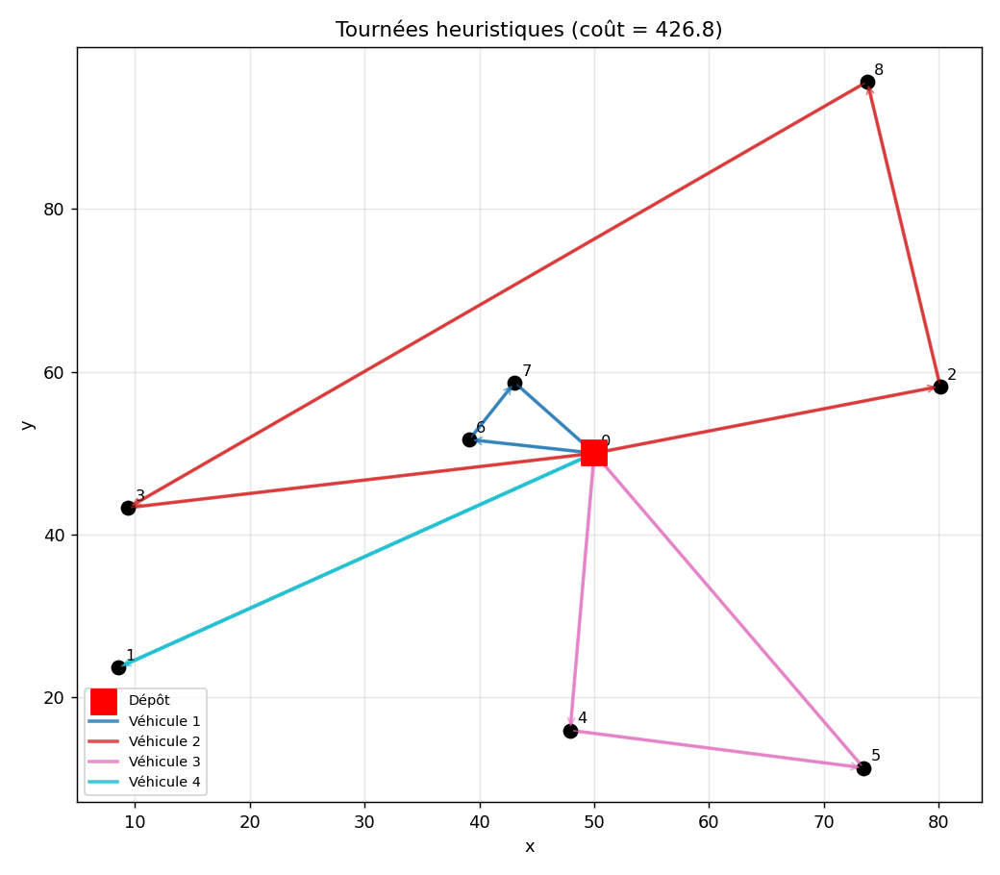

# Optimisation de Tournées de Véhicules (VRP)

> **Auteur :** Yasser Houssein Hassan
> **Domaine :** Recherche opérationnelle — Optimisation combinatoire, logistique, programmation linéaire en nombres entiers.

Ce projet traite la résolution du **Problème de Tournées de Véhicules** (*Vehicle Routing Problem*, VRP), introduit par Dantzig & Ramser (1959). Il s'agit d'un problème d'optimisation combinatoire **NP-difficile** central en logistique, généralisant le célèbre problème du voyageur de commerce (TSP). Le projet confronte une **méthode exacte** (programmation linéaire en nombres entiers, CPLEX) à une **heuristique** (plus proche voisin).

---

## 1. Énoncé du problème (CVRP)

On dispose d'un **dépôt** central, d'une flotte de $K$ véhicules de **capacité** $Q$ identique, et de $N$ **clients** géolocalisés, chacun de demande $d_i$. On cherche à construire un ensemble de tournées tel que :

- chaque client est visité **exactement une fois** par un seul véhicule ;
- chaque tournée **part et revient au dépôt** ;
- la demande cumulée d'une tournée **ne dépasse pas** la capacité $Q$ ;
- la **distance (ou le coût) totale** est minimisée.

Le graphe complet $G = (V, A)$ a pour sommets $V = \{0, 1, \dots, N\}$ (le dépôt est le sommet $0$) et pour coûts d'arc $c_{ij}$.

---

## 2. Méthode exacte — formulation PLNE avec contraintes MTZ

### 2.1 Variables de décision

| Variable | Type | Signification |
|---|---|---|
| $x_{ijk}$ | binaire | le véhicule $k$ se déplace directement de $i$ à $j$ |
| $y_{ik}$ | binaire | le véhicule $k$ dessert le client $i$ |
| $u_i$ | continue | ordre de passage du client $i$ (variable MTZ) |

### 2.2 Fonction objectif et contraintes

$$\min \; \sum_{k}\sum_{i}\sum_{j} c_{ij}\, x_{ijk}$$

sous les contraintes :

1. **Visite unique** : chaque client est desservi par exactement un véhicule.
2. **Conservation du flux** : pour chaque sommet, le nombre d'arcs entrants égale le nombre d'arcs sortants.
3. **Capacité** : $\sum_i d_i\, y_{ik} \leq Q,\ \forall k$.
4. **Départ / retour au dépôt** obligatoire.
5. **Élimination des sous-tours (Miller-Tucker-Zemlin)** :

$$u_i - u_j + Q\,x_{ij} \leq Q - d_j, \qquad \forall i,j \neq 0,\ i \neq j.$$

Les contraintes MTZ interdisent la formation de **cycles indépendants** ne passant pas par le dépôt, tout en encodant les contraintes de capacité de manière compacte. La résolution garantit l'**optimum global** (coût de $545$ € dans l'exemple du rapport).

---

## 3. Méthode heuristique — plus proche voisin (Nearest Neighbour)

Heuristique **gloutonne** : le véhicule part du dépôt, rejoint le client non visité le plus proche tant que sa capacité résiduelle le permet, puis revient au dépôt pour recharger. On itère jusqu'à livrer tous les clients.

- **Avantage** : résolution quasi instantanée, extensible aux instances industrielles de grande taille.
- **Inconvénient** : aucune garantie d'optimalité (coût de $615$ € dans l'exemple, soit $\approx +13\%$ par rapport à l'optimum).

---

## 4. Présentation du code Python

L'implémentation se trouve dans **`vrp_optimisation.py`** (script autonome) et **`Optimisation_Combinatoire.ipynb`** (avec carte interactive via `geopy` + `folium`).

### 4.1 Matrice des distances

```python
def matrice_distances(coords):
    # c_ij = || p_i - p_j ||_2 entre chaque paire de sites (dépôt = indice 0)
    diff = coords[:, None, :] - coords[None, :, :]
    return np.sqrt((diff**2).sum(axis=2))
```

### 4.2 Heuristique du plus proche voisin (avec capacité)

```python
def heuristique_plus_proche_voisin(D, demandes, Q):
    non_visites = set(range(1, len(demandes)))
    tournees, distance_totale = [], 0.0
    while non_visites:
        tournee, charge, position = [0], 0.0, 0
        while True:
            candidats = [j for j in non_visites if charge + demandes[j] <= Q]
            if not candidats:
                break
            j = min(candidats, key=lambda c: D[position, c])  # plus proche voisin
            distance_totale += D[position, j]
            tournee.append(j); charge += demandes[j]; position = j
            non_visites.remove(j)
        distance_totale += D[position, 0]   # retour au dépôt
        tournees.append(tournee + [0])
    return tournees, distance_totale
```

### 4.3 Modèle exact (extrait des contraintes MTZ)

```python
# Élimination des sous-tours + capacité (Miller-Tucker-Zemlin)
for (i, j) in arcs:
    if i != 0 and j != 0:
        prob += u[i] - u[j] + Q * x[(i, j)] <= Q - demandes[j]
```

### 4.4 Exécution

```bash
pip install numpy pulp        # pulp (solveur CBC) pour la résolution exacte
python vrp_optimisation.py
```

Le script génère une instance aléatoire, résout par l'heuristique puis (si un solveur est disponible) par PLNE/MTZ, et affiche l'**écart relatif** entre la solution heuristique et l'optimum global. Une figure est enregistrée sous `figure_tournees_vrp.png`.

### 4.5 Visualisation



Représentation géographique des tournées : le **dépôt** (carré rouge), les **clients** (points noirs numérotés), et les arcs orientés de chaque **véhicule** (une couleur par tournée). Chaque tournée part et revient au dépôt en respectant la contrainte de capacité.

> **Note.** Le rapport original utilise **IBM ILOG CPLEX**. Le script propose ici une formulation portable via **PuLP** (solveur CBC libre), substituable par CPLEX. La visualisation cartographique (`folium`) génère une carte HTML interactive sur fond géographique réel.

---

## 5. Comparaison des approches

| Critère | Exact (CPLEX / PLNE) | Heuristique (plus proche voisin) |
|---|---|---|
| **Optimalité** | Optimum global garanti | Sous-optimale |
| **Complexité** | Exponentielle (NP-difficile) | Polynomiale, quasi instantanée |
| **Passage à l'échelle** | Limité aux petites instances | Grandes instances industrielles |
| **Coût (exemple)** | 545 € | 615 € (+13 %) |

La méthode exacte est privilégiée pour les petits réseaux exigeant une solution certifiée optimale ; l'heuristique constitue un compromis pragmatique pour les problèmes de grande échelle où l'optimalité stricte est inaccessible en temps raisonnable.

---

## 6. Structure du dépôt

| Fichier | Description |
|---|---|
| `vrp_optimisation.py` | Script Python : heuristique + formulation exacte PLNE/MTZ. |
| `figure_tournees_vrp.png` | Figure générée : tracé géographique des tournées. |
| `Optimisation_Combinatoire.ipynb` | Notebook : CPLEX, heuristique, carte interactive. |
| `Optimisation_Combinatoire.pdf` | Rapport : équations, résultats, cartographie. |
| `README.md` | Le présent document. |

---

## Références

- Dantzig, G. B. & Ramser, J. H. (1959). *The Truck Dispatching Problem*. Management Science.
- Miller, C. E., Tucker, A. W. & Zemlin, R. A. (1960). *Integer Programming Formulation of Traveling Salesman Problems*. JACM.
- Toth, P. & Vigo, D. (2014). *Vehicle Routing: Problems, Methods, and Applications*. SIAM.

---
*Projet réalisé par Yasser Houssein Hassan*
